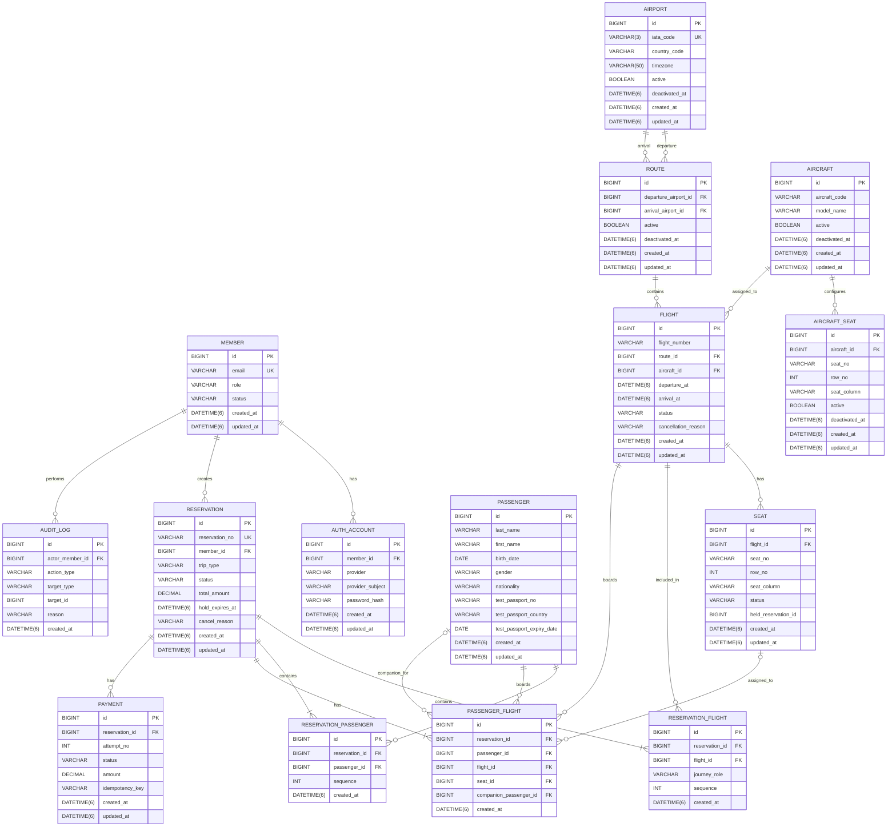

# KOKU Airline Renewal - ERD

## 1. 문서 목적

본 문서는 `05-data-api-design.md`를 기반으로
KOKU Airline Renewal의 MVP Database 구조를 시각화합니다.

본 ERD는 다음 문서를 기준으로 합니다.

- 비즈니스 규칙: `02-domain-policy.md`
- 시스템 구조: `04-system-design.md`
- 데이터 및 API 구조: `05-data-api-design.md`

본 문서는 Data Model을 새롭게 정의하는 문서가 아닙니다.

Entity, Column, Relation 및 Constraint의 최종 기준은
`05-data-api-design.md`를 따릅니다.

현재 확정되지 않은 Data Model은
ERD에서도 Draft 상태로 표현합니다.

---

## 2. MVP ERD



---

### 2.1 Date / Time 표기 원칙

ERD의 Date / Time Type은
`05-data-api-design.md`의 확정 정책을 따릅니다.

```text
절대 시각
→ Java Instant
→ MySQL DATETIME(6)
→ UTC

날짜
→ Java LocalDate
→ MySQL DATE

Airport Time Zone
→ IANA Zone ID
→ VARCHAR(50)
```

`DATETIME(6)` 자체에는 Time Zone 정보가 포함되지 않으며,
Application / JDBC / Hibernate의 시간 해석 기준을 UTC로 통일합니다.

---

## 3. 핵심 관계

### 3.1 Member - AuthAccount

```text
Member 1 : N AuthAccount
```

하나의 Member는 하나 이상의 인증 수단을 가질 수 있습니다.

MVP Provider:

```text
LOCAL
GOOGLE
```

`Member`는 서비스 사용자와 Role을 관리하고,
`AuthAccount`는 인증 수단을 관리합니다.

서비스 Role:

```text
MEMBER
ADMIN
SUPERADMIN
```

Spring Security 권한 Code:

```text
MEMBER     → USER
ADMIN      → ADMIN
SUPERADMIN → SUPERADMIN
```

---

### 3.2 Member - Reservation

```text
Member 1 : N Reservation
```

하나의 Reservation은 반드시 하나의 Member에 소속됩니다.

Member는 여러 Reservation을 생성할 수 있습니다.

Reservation의 사용자 공개 식별자는
Database PK가 아니라 `reservation_no`를 사용합니다.

---

### 3.3 Airport - Route

Route는 두 Airport를 참조합니다.

```text
departure_airport_id
arrival_airport_id
```

동일 Airport를 출발지와 도착지로 사용할 수 없습니다.

동일 방향 Route 중복을 허용하지 않습니다.

```text
UNIQUE(
  departure_airport_id,
  arrival_airport_id
)
```

---

### 3.4 Route - Flight

```text
Route 1 : N Flight
```

하나의 Flight는 하나의 Route에 속합니다.

Flight는 특정 날짜와 시간에 운항하는
KOKU Airline 내부 항공편입니다.

외부 실제 항공편은 `Flight` Entity에 저장하지 않습니다.

---

### 3.5 Aircraft - AircraftSeat

```text
Aircraft 1 : N AircraftSeat
```

`AircraftSeat`는 Aircraft의 기본 Seat Layout을 나타냅니다.

동일 Aircraft 안에서
Seat Number는 중복될 수 없습니다.

```text
UNIQUE(
  aircraft_id,
  seat_no
)
```

---

### 3.6 Aircraft - Flight

```text
Aircraft 1 : N Flight
```

하나의 Flight에는 하나의 Aircraft가 배정됩니다.

동일 Aircraft의 Flight 운항 시간이 겹치지 않아야 합니다.

정확한 충돌 시간 기준과 Turnaround Time은
아직 확정하지 않습니다.

---

### 3.7 Flight - Seat

```text
Flight 1 : N Seat
```

`AircraftSeat`는 Aircraft의 기본 Seat Configuration이고,
`Seat`는 특정 Flight에서 실제 예약 상태를 가지는 좌석입니다.

Flight 생성 시 Aircraft Seat Layout을 기반으로
Flight별 Seat를 구성하는 방향을 사용합니다.

동일 Flight에서 동일 Seat Number는 중복될 수 없습니다.

```text
UNIQUE(
  flight_id,
  seat_no
)
```

Seat 상태:

```text
AVAILABLE
HELD
RESERVED
UNAVAILABLE
```

---

## 4. Reservation 관계

### 4.1 Reservation - ReservationFlight

Reservation은 하나 이상의 Flight를 포함합니다.

```text
ONE_WAY
Reservation
  |
  └─ ReservationFlight
       journey_role = OUTBOUND
       sequence = 1
```

```text
ROUND_TRIP
Reservation
  |
  +─ ReservationFlight
  |    journey_role = OUTBOUND
  |    sequence = 1
  |
  └─ ReservationFlight
       journey_role = RETURN
       sequence = 2
```

하나의 Reservation에 동일 Flight가
중복 연결될 수 없습니다.

```text
UNIQUE(
  reservation_id,
  flight_id
)
```

`ReservationFlight`의 최종 JPA Entity 여부는
Data Design 확정 과정에서 결정합니다.

---

### 4.2 Reservation - ReservationPassenger

하나의 Reservation은
한 명 이상의 Passenger를 포함합니다.

```text
Reservation 1 : N ReservationPassenger
Passenger   1 : N ReservationPassenger
```

Reservation 내부에서 동일 Passenger를
중복 연결하지 않습니다.

```text
UNIQUE(
  reservation_id,
  passenger_id
)
```

`ROUND_TRIP`에서도 Passenger 자체를
출국 / 귀국별로 별도로 생성하지 않습니다.

동일 Passenger 구성을 두 Flight에 공통으로 사용합니다.

---

### 4.3 PassengerFlight

`PassengerFlight`는
Passenger의 Flight별 예약 속성을 표현합니다.

필요한 이유:

```text
Passenger
  |
  +-- Flight A → Adult / Seat 1A
  |
  +-- Flight B → Adult / Seat 3C
```

또는 연령 Boundary가 있는 경우:

```text
Passenger
  |
  +-- 출국 Flight → Infant
  |
  +-- 귀국 Flight → Child
```

따라서 다음 정보는 Flight별로 관리합니다.

- Seat
- Infant Companion
- Flight별 Adult / Child / Infant Validation

Adult / Child / Infant 값을
Passenger Table에 고정 상태로 저장하지 않습니다.

각 Flight의 탑승일과 Passenger의 `birth_date`를 기준으로
Backend에서 계산합니다.

---

### 4.4 PassengerFlight - Seat

Seat가 필요한 Passenger는
해당 Flight의 Seat를 연결합니다.

```text
passenger_flight.seat_id
```

Infant는 별도 Seat를 사용하지 않으므로:

```text
seat_id = NULL
```

을 허용합니다.

취소된 과거 Reservation의 PassengerFlight 기록은 유지될 수 있으므로
하나의 Seat가 시간 전체에 걸쳐
여러 PassengerFlight 이력과 연결될 수 있습니다.

동일 시점의 Seat 중복 확보는
Seat 상태와 Transaction / 동시성 제어를 통해 방지합니다.

---

### 4.5 Infant Companion

Passenger가 해당 Flight에서 Infant인 경우:

```text
passenger_flight.companion_passenger_id
```

를 이용하여 동반 Adult를 표현하는 방향을 사용합니다.

Companion은 동일 Reservation의 Passenger여야 하며
해당 Flight에서 Adult 조건을 만족해야 합니다.

Adult 한 명당
해당 Flight에서 최대 한 명의 Infant만 연결할 수 있습니다.

구체적인 Database Constraint와 Validation 방식은
Data Design 확정 과정에서 결정합니다.

---

## 5. Payment 관계

### 5.1 Reservation - Payment

```text
Reservation 1 : N Payment
```

하나의 Payment는
하나의 Mock Payment 시도를 나타냅니다.

별도의 `PaymentAttempt` Entity는 사용하지 않습니다.

Payment 상태:

```text
PENDING
SUCCESS
FAILED
CANCELLED
REFUNDED
```

하나의 Reservation당 최대 3회의 Payment를 허용합니다.

```text
attempt_no = 1
attempt_no = 2
attempt_no = 3
```

---

### 5.2 Payment Idempotency

동일 Mock Payment 요청의 중복 처리를 방지하기 위해
Payment에 `idempotency_key`를 저장합니다.

초안 Constraint:

```text
UNIQUE(
  reservation_id,
  idempotency_key
)
```

하나의 Reservation에는
최대 하나의 `SUCCESS` Payment만 존재해야 합니다.

구체적인 Database 보호 방식은
MySQL 및 Transaction 구조를 검토한 뒤 확정합니다.

---

## 6. AuditLog 관계

### 6.1 Member - AuditLog

```text
Member 1 : N AuditLog
```

`actor_member_id`는
관리 작업을 수행한 Admin 또는 SuperAdmin을 참조합니다.

최소 Audit 대상:

- Flight 취소
- SuperAdmin Reservation 강제 취소
- 중요 Master Data 생성
- 중요 Master Data 수정
- 중요 Master Data 비활성화

---

### 6.2 Audit Target

Audit 대상은 초안에서 다음 구조로 표현합니다.

```text
target_type
target_id
```

예:

```text
target_type = FLIGHT
target_id   = 101
```

또는:

```text
target_type = RESERVATION
target_id   = 5001
```

`target_id`는 여러 종류의 Entity를 가리킬 수 있으므로
현재 ERD에서는 특정 Entity와 FK Relation으로 연결하지 않습니다.

Audit Target의 세부 구조는
Data Design 확정 과정에서 최종 결정합니다.

---

## 7. 주요 Unique Constraint

현재 Data Design 초안 기준
주요 Unique Constraint는 다음과 같습니다.

```text
member.email
    UNIQUE

auth_account(provider, provider_subject)
    UNIQUE

airport.iata_code
    UNIQUE

route(departure_airport_id, arrival_airport_id)
    UNIQUE

aircraft_seat(aircraft_id, seat_no)
    UNIQUE

seat(flight_id, seat_no)
    UNIQUE

reservation.reservation_no
    UNIQUE

reservation_flight(reservation_id, flight_id)
    UNIQUE

reservation_passenger(reservation_id, passenger_id)
    UNIQUE

payment(reservation_id, idempotency_key)
    UNIQUE
```

추가 Composite Unique Constraint는
Data Model 확정 후 추가합니다.

---

## 8. ERD에서 아직 확정하지 않는 항목

다음 사항은 현재 Draft ERD에서
최종 확정하지 않습니다.

### Flight / Aircraft

- [ ] Flight Number Composite Unique Constraint
- [ ] Aircraft Schedule Conflict 기준
- [ ] Turnaround Time

### Seat

- [ ] `AircraftSeat`의 통로 표현 방식
- [ ] Flight별 Seat 생성 시점
- [ ] `Seat.held_reservation_id` 직접 FK 사용 여부
- [ ] Seat 동시성 Lock 방식

### Reservation Mapping

- [ ] `ReservationFlight`의 최종 JPA Entity 여부
- [ ] `ReservationPassenger`의 최종 JPA Entity 여부
- [ ] `PassengerFlight`의 최종 JPA Entity 여부
- [ ] Mapping Entity별 추가 Constraint

### Passenger

- [ ] `gender` Enum 상세 값
- [ ] `nationality` 저장 형식
- [ ] Test Passport Number 형식
- [ ] Test Passport Encryption
- [ ] Test Passport API Masking
- [ ] Infant Companion Database Constraint

### Payment

- [ ] 하나의 Reservation당 최대 하나의 `SUCCESS` Payment를 보장하는 Database 구조
- [ ] `attempt_no` 추가 Unique Constraint 여부
- [ ] Idempotency 동일 Key + 다른 Request 처리 방식

### Audit

- [ ] Audit Target 구조 최종 확정
- [ ] Audit 변경 전 / 후 값 저장 여부

---

## 9. ERD 변경 원칙

ERD는 `05-data-api-design.md`의 시각적 표현입니다.

따라서 ERD 자체에서
새로운 Business Rule 또는 Data Model을 먼저 확정하지 않습니다.

변경 순서:

```text
Domain Policy 변경 필요
        |
        v
02-domain-policy.md
        |
        v
04-system-design.md 검토
        |
        v
05-data-api-design.md 수정
        |
        v
ERD 수정
```

단순한 Data Model 변경인 경우:

```text
05-data-api-design.md 수정
        |
        v
ERD 수정
```

ERD와 `05-data-api-design.md`의 내용이 충돌하는 경우
`05-data-api-design.md`를 우선 기준으로 합니다.